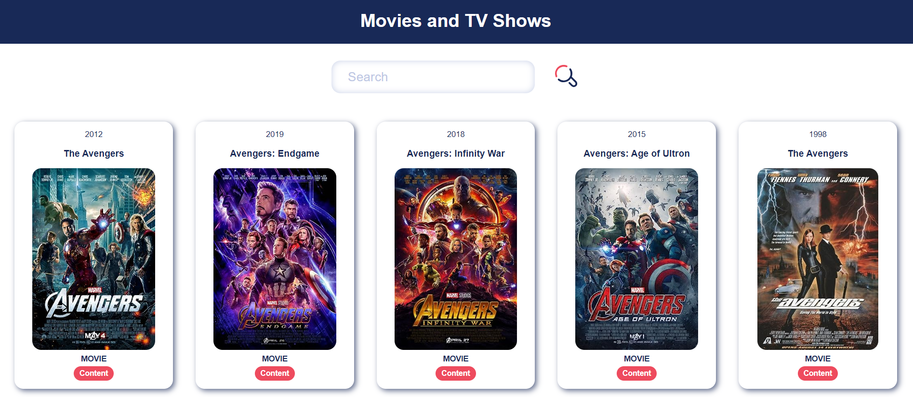
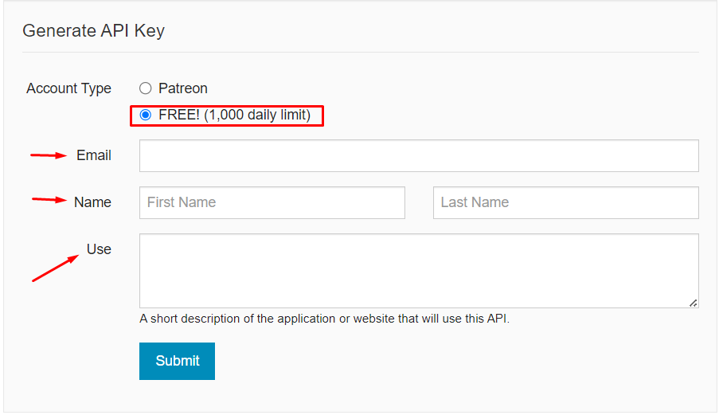
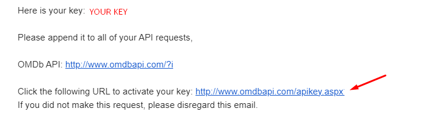
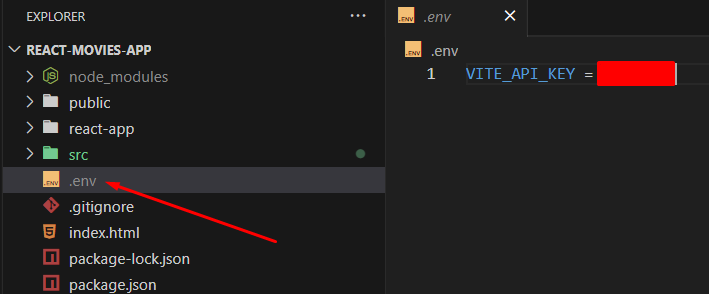

## Overview

This application aims to create a SPA where genres such as movies and series can be listed with the OMDb API. Developed using React+Vite+TS.

## Clone and initialize the repo

Once you have the prerequisites installed, you can get the code and initialize the build environment.

```bash
git clone https://github.com/zehranurkok/React-Movies-App.git
cd path-to-your-project-folder

# Install dependencies (only the first time)
npm install

# Run the local server at localhost:8080
npm run dev
```
## Important

Please follow the steps below for the application to work properly.


# 1. Get API Key

You can [visit OMDb API Page](http://www.omdbapi.com/apikey.aspx) to get API Key.

Fill in the fields shown in red below. Then click the SUBMIT button.



Then check your mail and activate your API Key by clicking the link shown with the red arrow below.
Copy your Key in the field that says YOUR KEY.



# 2. Use API Key

Create your .env file in the root directory as indicated by the red arrow below. Then paste the Key that you copied into the area indicated by the red square.



That's it!